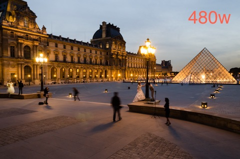

<figure>
<picture>
	<!--[if IE 9]><video style="display: none;"><![endif]-->
	<source srcset="images/2012-09-20-Louvre-900w.jpg, images/2012-09-20-Louvre.jpg 2x" media="(min-width:480px)">
	<!--[if IE 9]></video><![endif]-->
	
</picture>
<noscript>

</noscript>
<figcaption>Wedding Pictures at Le Louvre, Paris
  &copy;&nbsp;#{ site.author.name.sub " ", "&nbsp;" }
</figcaption>
</figure>

