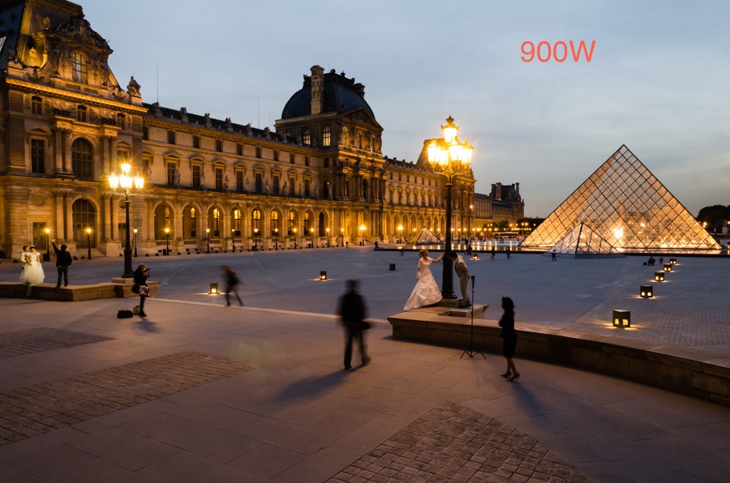

<figure>

<!-- Fallback content for non-JS browsers. Same img src as the initial, unqualified source element. -->
<noscript>

</noscript>

<figcaption>Wedding Pictures at Le Louvre, Paris &copy; Jeff Mesnil</figcaption>
</figure>
